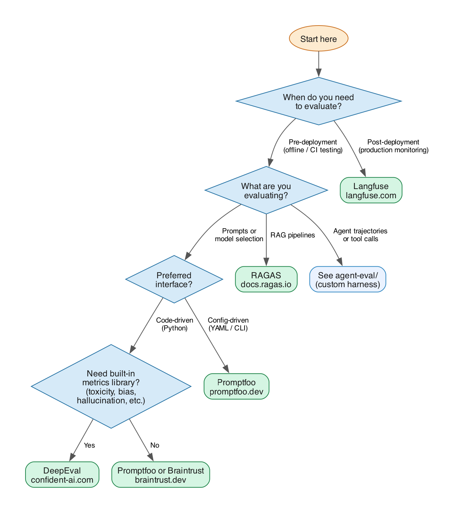

# supereval

**supereval** is a dataset registry and eval runner for LLM applications and AI agents, built on top of [Promptfoo](https://www.promptfoo.dev).

## How It Works

supereval covers three evaluation modes:

**LLM eval** — test prompt quality and model behaviour against typed datasets (Q&A, classification, instruction-following). Promptfoo handles model calls and scoring; you never write Promptfoo config by hand.

**RAG eval** — test retrieval-augmented generation pipelines against datasets with committed context documents. Each test case includes the query, the retrieved context chunks, and the expected ground truth. supereval calls the model directly and scores each case on contains accuracy, faithfulness to context (no hallucination), and answer correctness — all via a Bedrock judge.

**Agent eval** — test tool-use agents end-to-end against datasets with mock tool environments. Each test case defines the task, canned tool responses, and expected outcome. The agent runs deterministically against mock tools; supereval scores the trajectory across four dimensions: answer correctness, tool usage, efficiency, and reasoning quality.

## Install

```bash
pip install -e .                       # core install
pip install -e '.[pdf]'               # add PDF support
pip install -e '.[anthropic]'         # add Anthropic API generator backend
pip install -e '.[openai]'            # add OpenAI / Azure OpenAI generator backend
pip install -e '.[mcp]'               # add MCP server (Claude Code, Kiro integration)
npm install -g promptfoo              # required for supereval run
```

AWS credentials must be configured for Bedrock features (`supereval generate`, Bedrock models in `supereval run`). Standard boto3 credential resolution applies: environment variables, `~/.aws/credentials`, or an IAM role.

## Quickstart

```bash
# 1. Create a dataset
supereval dataset create aws-support-qa \
  --type qa \
  --description "Factual Q&A for AWS support chatbot" \
  --tags "aws,support"

# 2a. Generate test cases from your documents (recommended)
supereval generate aws-support-qa --from docs/kb/ --count 30
#     → writes aws-support-qa_staged.jsonl for your review

# 2b. Or write cases manually and add them
supereval dataset add-cases aws-support-qa --from cases.jsonl

# 3. Run an eval
supereval run aws-support-qa --model anthropic:claude-opus-4-6

# 4. Capture a baseline
supereval run aws-support-qa --model anthropic:claude-opus-4-6 --update-baseline

# 5. On your next change, check for regressions
supereval run aws-support-qa --model anthropic:claude-opus-4-6 --compare-baseline
```

## Documentation

| Guide | Contents |
|---|---|
| [Getting started tutorial](./docs/tutorial.md) | End-to-end walkthrough: create a dataset, run an eval, capture a baseline, catch a regression |
| [How scoring works](./docs/scoring.md) | What "pass" means for each dataset type; RAG scoring metrics; agent scoring dimensions; threshold semantics |
| [Writing good test cases](./docs/writing-test-cases.md) | Case quality, difficulty distribution, rubric writing, RAG context design, agent mock environments |
| [MCP server setup](./docs/mcp.md) | Connect supereval to Claude Code, Kiro, and other AI tools; environment variables; troubleshooting |
| [Custom Promptfoo config](./docs/custom-config.md) | Tier 3 config, custom asserts, model parameters, custom grading providers |
| [Agent runner examples](./docs/agent-examples.md) | ReAct/Bedrock, LangChain, and Bedrock Agents runners explained with tradeoffs |
| [Troubleshooting](./docs/troubleshooting.md) | Common errors and fixes: credentials, dataset validation, all-cases-failing, DuckDB, agent crashes |
| [Upgrading](./docs/upgrading.md) | Schema migrations, dataset format stability, baseline.json format, environment separation |

---

## Dataset Types

Each dataset has a `type` that defines the shape of its test cases.

### `qa` — question with a known correct answer
```json
{
  "description": "SQS message size limit",
  "input": { "query": "What is the maximum size of an SQS message?" },
  "expected": { "ground_truth": "256 KB" },
  "tags": ["sqs", "limits"],
  "difficulty": "easy"
}
```

### `classification` — input maps to a label
```json
{
  "description": "Route a networking incident",
  "input": { "text": "My EC2 instance lost internet access after modifying the route table" },
  "expected": { "label": "networking" },
  "tags": ["ec2", "routing"]
}
```

### `instruction` — open-ended task scored by rubric
```json
{
  "description": "Summarize an incident report",
  "input": {
    "instruction": "Summarize this incident report in 3 bullet points",
    "document": "On March 10th at 14:32 UTC, a misconfigured IAM policy..."
  },
  "expected": {
    "rubric": "Must contain exactly 3 bullet points. Must include root cause, impact, and resolution."
  }
}
```

### `rag` — question answered from retrieved context documents
```json
{
  "description": "S3 bucket region lookup",
  "input": {
    "query": "What region is my-data-bucket in?",
    "retrieved_contexts": [
      "The bucket my-data-bucket was created in us-west-2 in January 2024.",
      "S3 bucket names are globally unique but buckets exist in a specific region."
    ]
  },
  "expected": { "ground_truth": "us-west-2" },
  "tags": ["s3", "region"],
  "difficulty": "easy"
}
```

## Running Evals

### Tier 1 — no Promptfoo knowledge required
```bash
supereval run my-dataset --model anthropic:claude-opus-4-6
```
supereval auto-generates the prompt template based on the dataset type.

### Tier 2 — custom prompt
```bash
supereval run my-dataset \
  --model anthropic:claude-opus-4-6 \
  --prompt "You are an AWS expert. Answer concisely: {{query}}"
```

### Tier 3 — bring your own Promptfoo config
Provide a `promptfoo.yaml` with `prompts` and `providers`. supereval injects the test cases automatically — you never write the `tests` section by hand.
```bash
supereval run my-dataset --config promptfoo.yaml
```

### Multiple models (model comparison)
```bash
supereval run my-dataset \
  --model anthropic:claude-opus-4-6 \
  --model openai:gpt-4o
```
A case passes only if **all** models pass it.

## Baseline & Regression Detection

```bash
# Save current results as baseline (run once on main after initial setup)
supereval run my-dataset --model <model> --update-baseline

# Compare against baseline (run on PRs)
supereval run my-dataset --model <model> --compare-baseline

# Save results to a file
supereval run my-dataset --model <model> --compare-baseline --output results.json
```

`baseline.json` is committed to git alongside your test cases. The CI workflow updates it automatically on every push to main.

## Configuring Thresholds

Thresholds are set per-dataset in `dataset.json`. Defaults are zero tolerance.

```json
{
  "thresholds": {
    "pass_rate": 0.90,
    "fail_on_regression": true,
    "max_score_drop": 0.05,
    "max_cost_usd": 1.00,
    "max_p95_latency_ms": 3000
  }
}
```

| Field | Default | Meaning |
|---|---|---|
| `pass_rate` | `1.0` | Minimum fraction of cases that must pass |
| `fail_on_regression` | `true` | Fail if any previously-passing case now fails |
| `max_score_drop` | `null` | Max allowed pass rate drop vs baseline (e.g. `0.05` = 5%) |
| `max_cost_usd` | `null` | Fail if total run cost exceeds this amount (USD) |
| `max_p95_latency_ms` | `null` | Fail if p95 response latency exceeds this threshold (ms) |

## Dataset Versioning

Tag named snapshots of a dataset for reproducible comparisons and safe rollbacks.

```bash
# Snapshot the current cases as v1.0.0
supereval dataset version tag aws-support-qa v1.0.0 --description "Initial release"

# List all versions
supereval dataset version list aws-support-qa

# Preview cases in a version
supereval dataset version show aws-support-qa v1.0.0

# Roll back to a previous version (prompts for confirmation)
supereval dataset version restore aws-support-qa v1.0.0

# Skip confirmation (useful in scripts)
supereval dataset version restore aws-support-qa v1.0.0 --yes
```

Version strings follow semantic versioning: `v<MAJOR>.<MINOR>.<PATCH>` (e.g. `v1.0.0`, `v2.1.3`).

Each version is a self-contained snapshot stored under `datasets/<name>/versions/<version>/` alongside `dataset.json` and `cases.jsonl`. The snapshot is never modified — `restore` only overwrites the working `cases.jsonl`.

**Suggested workflow:**
1. Build your initial case set → `version tag v1.0.0`
2. Add cases, iterate → `version tag v1.1.0`
3. Commit `baseline.json` alongside each version tag so you can compare across versions
4. Roll back with `version restore` if a batch of generated cases turns out to be low quality

## CI Setup

### GitHub Actions

Copy `.github/workflows/eval.yml` to your repository. Configure the dataset name and model:

```yaml
env:
  DATASET: aws-support-qa
  MODEL: anthropic:claude-opus-4-6
```

Add your model provider API key as a repository secret (e.g. `ANTHROPIC_API_KEY`).

**What the workflow does:**
- **On PR** — runs eval, compares to baseline, fails the build on regression
- **On push to main** — runs eval, updates `baseline.json`, commits it back

### AWS CodeBuild / CodePipeline

Copy `codebuild/buildspec.yml` to your repository. Set these environment variables in your CodeBuild project or CodePipeline action:

```yaml
DATASET: aws-support-qa
MODEL: anthropic:claude-opus-4-6
SUPEREVAL_MODE: pr    # or: main
```

- **`SUPEREVAL_MODE=pr`** — compare against baseline; use on PR/feature branch pipelines
- **`SUPEREVAL_MODE=main`** — update baseline and commit it back; use on the main branch pipeline

Store API keys in SSM Parameter Store and reference them in the buildspec `parameter-store` block. The CodeBuild IAM role needs `bedrock:InvokeModel` (if using Bedrock) and `s3:GetObject`/`s3:ListObjectsV2` on your documents bucket (if using S3 sources).

### GitLab CI

Copy `gitlab/eval.yml` to `.gitlab-ci.yml` in your repository (or include it via `include:`). Set these CI/CD variables in your GitLab project settings:

```
DATASET=aws-support-qa
MODEL=anthropic:claude-opus-4-6
ANTHROPIC_API_KEY=...   # set as a masked variable in Settings → CI/CD → Variables
```

The pipeline runs `--compare-baseline` on merge requests and `--update-baseline` on pushes to the default branch.

### CircleCI

Copy `circleci/config.yml` to `.circleci/config.yml` in your repository. Set these environment variables in your CircleCI project settings (Project Settings → Environment Variables):

```
DATASET=aws-support-qa
MODEL=anthropic:claude-opus-4-6
ANTHROPIC_API_KEY=...
```

The workflow runs `--compare-baseline` on feature branches and `--update-baseline` on `main`.

## Cost & Latency Tracking

Every `supereval run` automatically records cost, token usage, and latency to a local DuckDB database (`supereval.db` in the current directory, override with `SUPEREVAL_DB_PATH`).

### Viewing run history

```bash
# List recent runs across all datasets
supereval history list

# Filter by dataset
supereval history list --dataset aws-support-qa

# Show details for a specific run
supereval history show <run-id>

# Include per-case results
supereval history show <run-id> --cases

# Aggregate stats over the last N runs
supereval history stats aws-support-qa
supereval history stats aws-support-qa --last 20
```

### Sample `history list` output

```
Run ID       Dataset          Ran at               Pass rate  Cost ($)  p95 (ms)
run_4a1b2c   aws-support-qa   2025-11-01 09:14:03   100.0%    0.0042    1823
run_3f8e9d   aws-support-qa   2025-10-30 16:52:11    93.3%    0.0038    1941
```

### Skipping the history store

```bash
supereval run aws-support-qa --model anthropic:claude-opus-4-6 --no-record
```

### Environment variables

| Variable | Default | Purpose |
|---|---|---|
| `SUPEREVAL_DB_PATH` | `./supereval.db` | Path to the DuckDB history database |
| `SUPEREVAL_DATASETS_DIR` | `./datasets` | Root directory for dataset files |

## MCP Server

supereval ships an MCP (Model Context Protocol) server so AI coding assistants — Claude Code, Kiro, and any other MCP-compatible tool — can operate supereval on behalf of users via natural language.

### Install

```bash
pip install 'supereval[mcp]'
```

### Register with your AI tool

**Claude Code** (`~/.claude.json`):

```json
{
  "mcpServers": {
    "supereval": {
      "command": "supereval",
      "args": ["mcp"]
    }
  }
}
```

**Kiro** (`.kiro/settings/mcp.json`):

```json
{
  "mcpServers": {
    "supereval": {
      "command": "supereval",
      "args": ["mcp"]
    }
  }
}
```

Then just describe what you want in natural language and the AI assistant figures out which tool to call:

> *"Create a QA dataset for my AWS docs, generate 20 cases from docs/, and run them against claude-haiku"*

> *"Show me the last 5 eval runs and their pass rates"*

> *"Tag the current state of aws-support-qa as v1.2.0 before I add new cases"*

### Available tools

| Tool | What it does |
|---|---|
| `list_datasets` | List all LLM evaluation datasets |
| `show_dataset` | Full details, thresholds, and case preview |
| `create_dataset` | Create a new dataset (qa / classification / instruction) |
| `add_cases` | Import cases from a JSONL file |
| `validate_dataset` | Validate all cases against the schema |
| `run_eval` | Run a dataset against a model (requires promptfoo) |
| `run_all_evals` | Run all datasets against a model |
| `generate_cases` | Generate cases from docs, S3, or a URL |
| `list_history` | Recent eval runs (optionally filtered by dataset) |
| `show_run` | Details and per-case results for a specific run |
| `get_stats` | Aggregated pass rate / cost / latency stats |
| `version_tag` | Snapshot dataset as a named version |
| `version_list` | List all saved versions |
| `version_restore` | Restore dataset to a previous version |
| `list_agent_datasets` | List agent evaluation datasets |
| `show_agent_dataset` | Full details for an agent dataset |
| `create_agent_dataset` | Create a new agent dataset |
| `agent_run_eval` | Run an agent evaluation |

### Start manually

```bash
supereval mcp
```

The server speaks the MCP stdio transport, so you can also pipe it directly from any MCP client.

For full setup instructions, environment variable configuration, and troubleshooting, see [docs/mcp.md](./docs/mcp.md).

---

## Agent Eval

### Agent quickstart

```bash
# 1. Create an agent dataset with tool definitions
supereval agent dataset create aws-support-agent \
  --tool-specs tools.json \
  --description "Agent that answers AWS support questions via search"

# 2. Add test cases (see format below)
supereval agent dataset add-cases aws-support-agent --from cases.jsonl

# 3. Run eval against your agent
supereval agent run aws-support-agent \
  --runner myapp.agents:SupportAgent

# 4. Capture a baseline
supereval agent run aws-support-agent \
  --runner myapp.agents:SupportAgent \
  --update-baseline

# 5. Check for regressions on future changes
supereval agent run aws-support-agent \
  --runner myapp.agents:SupportAgent \
  --compare-baseline
```

### Implementing AgentRunner

Implement the `AgentRunner` protocol for your framework and pass it via `--runner`:

```python
# myapp/agents.py
from supereval.agent.models import Trajectory, Step, StepType, ToolCall

class SupportAgent:
    def run(self, task: str, tool_executor) -> Trajectory:
        steps = []
        # Your agent loop here — call tool_executor.execute() for tool calls
        result = tool_executor.execute("search_kb", {"query": task})
        steps.append(Step(
            type=StepType.tool_call,
            content="searching KB",
            tool_call=ToolCall(name="search_kb", arguments={"query": task}, result=result),
        ))
        steps.append(Step(type=StepType.answer, content=str(result[0])))
        return Trajectory(steps=steps, final_answer=str(result[0]))
```

Reference implementations for common frameworks are in `examples/`:
- `react_bedrock.py` — custom ReAct loop on Amazon Bedrock
- `bedrock_agents.py` — AWS Bedrock Agents (integration testing against live infra)
- `langchain.py` — LangChain tool-use agent backed by mock tools

### Agent test case format

```json
{
  "description": "Agent resolves S3 bucket region via search",
  "tags": ["s3", "routing"],
  "difficulty": "medium",
  "input": {
    "task": "Which region is my-data-bucket in?"
  },
  "tools": {
    "search_kb": {
      "response": [{"bucket": "my-data-bucket", "region": "us-west-2"}],
      "latency_ms": 80
    },
    "delete_bucket": {
      "error": "AccessDenied"
    }
  },
  "expected": {
    "answer": "us-west-2",
    "answer_match": "contains",
    "must_call": ["search_kb"],
    "must_not_call": ["delete_bucket"],
    "must_call_with": [{"tool": "search_kb", "args": {}}],
    "max_steps": 6,
    "max_tool_calls": 3
  }
}
```

The `tools` block defines the **mock environment** for this case — canned responses or errors per tool. The agent thinks it's calling real tools. This makes cases self-contained and reproducible in CI.

### Tool catalog (`tools.json`)

Tool definitions (name, description, JSON Schema) are shared across all cases in a dataset:

```json
[
  {
    "name": "search_kb",
    "description": "Search the knowledge base",
    "parameters": {
      "type": "object",
      "properties": { "query": { "type": "string" } },
      "required": ["query"]
    }
  }
]
```

### Scoring dimensions

Each case is scored across four independent dimensions (0.0–1.0):

| Dimension | How scored | Fails case if |
|---|---|---|
| `answer_score` | exact / contains / regex / LLM judge | below `min_answer_score` (default 0.8) |
| `tool_score` | `must_call`, `must_not_call`, `must_call_with` checks | below `min_tool_score` (default 1.0) |
| `efficiency_score` | normalized step count vs `max_steps` | informational by default |
| `reasoning_score` | LLM judge on thought chain (optional) | below `min_reasoning_score` if set |

A **composite score** is the weighted average (default weights: answer 40%, tool 40%, efficiency 5%, reasoning 15% when enabled).

### Agent thresholds

```json
{
  "thresholds": {
    "pass_rate": 1.0,
    "min_answer_score": 0.8,
    "min_tool_score": 1.0,
    "min_reasoning_score": null,
    "fail_on_regression": true,
    "max_cost_usd": null,
    "max_p95_latency_ms": null
  }
}
```

### LLM-as-judge (optional)

Pass `--judge-model` to enable answer and reasoning scoring via Bedrock:

```bash
supereval agent run aws-support-agent \
  --runner myapp.agents:SupportAgent \
  --judge-model anthropic.claude-3-5-sonnet-20241022-v2:0
```

Without `--judge-model`, `answer_match: llm_judge` falls back to `contains` and reasoning scoring is skipped.

## Generating Agent Test Cases

Bootstrap an agent dataset from real execution traces or from your documentation.

```bash
supereval agent generate my-dataset --from production_traces.jsonl
```

Reviewed cases are staged for import. Add `--auto-import` to skip staging, or `--interactive` to walk through each case.

The command works in two modes, detected automatically from `--from`:

- **Traces mode** (`.jsonl` file) — converts real execution traces to cases, including mock tool responses
- **Document mode** (file, directory, S3, URL) — uses LLM to generate task scenarios from your documentation; the dataset's tool catalog drives what tools appear in `must_call`

```bash
# From traces
supereval agent generate my-dataset --from production_traces.jsonl

# From documents (Bedrock, default)
supereval agent generate my-dataset --from docs/ --count 20

# From documents (Anthropic)
supereval agent generate my-dataset --from docs/ --backend anthropic --count 10

# From S3
supereval agent generate my-dataset --from s3://bucket/docs/ --count 20

# Interactive review before staging
supereval agent generate my-dataset --from docs/ --interactive
```

In document mode, the `tools` block in each generated case is left **empty** — mock responses can't be inferred from docs alone. The recommended workflow is:
1. Generate task scenarios from docs → review with `--interactive`
2. Run your agent against the generated tasks to collect real traces
3. Import those traces with `--from traces.jsonl` to fill in mock responses

### Trace format (JSONL, one trace per line)

```json
{
  "task": "Which region is my-data-bucket in?",
  "steps": [
    {"type": "thought", "content": "I should search for this bucket."},
    {"type": "tool_call", "tool": "search_kb",
     "arguments": {"query": "my-data-bucket"},
     "result": {"region": "us-west-2"}},
    {"type": "answer", "content": "The bucket is in us-west-2."}
  ],
  "final_answer": "us-west-2",
  "metadata": {
    "description": "S3 bucket region lookup",
    "difficulty": "easy",
    "tags": ["s3", "region"]
  }
}
```

**Step types:** `thought`, `tool_call`, `observation`, `answer`

**What gets inferred automatically:**

| Field | Inferred from |
|---|---|
| `expected.answer` | `final_answer`, or content of last `answer` step |
| `expected.must_call` | unique tool names from `tool_call` steps (in order) |
| `tools` (mock responses) | last `result` seen per tool name |
| `expected.max_steps` | `ceil(steps × 1.5)`, minimum 3 |
| `expected.max_tool_calls` | tool call count + 1 |
| `description`, `tags`, `difficulty` | `metadata` block |

Traces can be produced by any agent framework — write a small export adapter that maps your framework's trace format to the supereval native format.

### Agent history

Agent runs are stored in the same `supereval.db` as LLM runs:

```bash
supereval agent history list [--dataset <name>] [--limit N]
supereval agent history show <run-id> [--steps]
supereval agent history stats <dataset> [--last N]
```

## Synthetic Generation

Generate test cases from your documents using Claude. Cases are staged for review before being added to your dataset.

**Supported dataset types:** `qa`, `classification`, `instruction`, `rag`

**Supported document sources:** local files/directories, Amazon S3, URLs (with optional crawling)

**Supported backends:** Amazon Bedrock (default), Anthropic API, OpenAI, Azure OpenAI

```bash
# Generate from a local file (Bedrock, default)
supereval generate aws-support-qa --from docs/s3-guide.md --count 20

# Generate from a local directory
supereval generate aws-support-qa --from docs/ --count 50

# Generate from S3
supereval generate aws-support-qa --from s3://my-bucket/docs/ --count 20

# Use the Anthropic API instead of Bedrock
supereval generate aws-support-qa --from docs/ --backend anthropic

# Use OpenAI
supereval generate aws-support-qa --from docs/ --backend openai --model gpt-4o

# Use Azure OpenAI
supereval generate aws-support-qa --from docs/ --backend azure-openai \
  --model gpt-4o --azure-endpoint https://my-instance.openai.azure.com/

# Generate from a URL
supereval generate aws-support-qa --from https://docs.example.com/guide.html

# Crawl a documentation site (follows links under the same URL prefix)
supereval generate aws-support-qa \
  --from https://docs.aws.amazon.com/lambda/latest/dg/ \
  --crawl --max-pages 30

# Custom Bedrock model or region
supereval generate aws-support-qa --from docs/ --count 20 \
  --model us.anthropic.claude-3-5-sonnet-20241022-v2:0 \
  --region us-west-2

# Review each case interactively before importing
supereval generate aws-support-qa --from docs/ --count 20 --interactive

# Skip review and import directly (useful in pipelines)
supereval generate aws-support-qa --from docs/ --count 20 --auto-import
```

For `qa` datasets, generated cases cover a mix of types: **factual** (40%), **multi-hop** (20%), **negation** (15%), **out-of-scope** (15%), **ambiguous** (10%).

The staged file includes a `source_excerpt` field showing which part of the document each case came from — use this to verify accuracy before importing. This field is ignored when importing.

**Supported document formats:** `.txt`, `.md`, `.pdf` (requires `pip install 'supereval[pdf]'`)

**S3 requirements:** boto3 (already a core dependency) + `s3:ListObjectsV2` and `s3:GetObject` on the bucket.

**Anthropic API requirements:** `pip install 'supereval[anthropic]'` + `ANTHROPIC_API_KEY` environment variable.

**OpenAI requirements:** `pip install 'supereval[openai]'` + `OPENAI_API_KEY` environment variable.

**Azure OpenAI requirements:** `pip install 'supereval[openai]'` + `AZURE_OPENAI_API_KEY` + `AZURE_OPENAI_ENDPOINT` (or pass `--azure-endpoint`).

### Classification generation

Classification datasets require labels to be defined on the dataset:

```bash
# Create with labels
supereval dataset create ticket-router \
  --type classification \
  --labels "billing,networking,storage,security"

# Generate label-aware cases from your docs
supereval generate ticket-router --from docs/ --count 30
```

### Instruction generation

Instruction datasets work the same way — rubrics are generated automatically from the document:

```bash
supereval dataset create incident-summarizer --type instruction
supereval generate incident-summarizer --from runbooks/ --count 20
```

## CLI Reference

### LLM eval

```
supereval dataset create <name> --type <type> [--description] [--tags] [--author] [--labels]
supereval dataset list
supereval dataset show <name> [--limit N]
supereval dataset add-cases <name> --from <file.jsonl>
supereval dataset validate <name>
supereval dataset export <name> [--output <file.yaml>]

supereval dataset version tag <name> <version> [--description]
supereval dataset version list <name>
supereval dataset version show <name> <version> [--limit N]
supereval dataset version restore <name> <version> [--yes]

supereval generate <dataset>
  --from <path-or-url>        # local file, directory, s3://bucket/prefix, or https:// URL (required)
  --count N                   # number of cases to generate (default: 20)
  --output <staged.jsonl>     # staging file path (default: <dataset>_staged.jsonl)
  --backend bedrock|anthropic|openai|azure-openai  # generator backend (default: bedrock)
  --model <model-id>          # model ID for selected backend (defaults per backend)
  --region <aws-region>       # AWS region for Bedrock (default: us-east-1)
  --azure-endpoint <url>      # Azure OpenAI endpoint URL (azure-openai backend only; or AZURE_OPENAI_ENDPOINT)
  --crawl                     # follow links under the same URL prefix (URL sources only)
  --max-pages N               # max pages to fetch when --crawl is set (default: 20)
  --auto-import               # skip staging, import directly
  --interactive               # review each case before staging/importing ([k]eep/[e]dit/[s]kip/[q]uit)

supereval providers           # list valid model IDs for generate and run

supereval run <dataset>
  --model <provider-id>     # repeat for multiple models
  --prompt <template>       # optional custom prompt
  --config <promptfoo.yaml> # optional full Promptfoo config
  --compare-baseline        # fail on regression vs baseline.json
  --update-baseline         # save results as new baseline
  --output <results.json>   # save full results to file
  --no-record               # skip persisting run to history store

supereval history list [--dataset <name>] [--limit N]
supereval history show <run-id> [--cases]
supereval history stats <dataset> [--last N]

supereval run-all
  --model <provider-id>     # repeat for multiple models
  --config <promptfoo.yaml> # optional full Promptfoo config (applied to all datasets)
  --compare-baseline        # compare each dataset against its baseline
  --update-baseline         # update baselines for all datasets after running
  --output-dir <dir>        # write per-dataset JSON results to this directory
  --no-record               # skip persisting runs to history store
```

### RAG eval

```
supereval rag dataset create <name> [--description] [--tags]
supereval rag dataset list
supereval rag dataset show <name>
supereval rag dataset add-cases <name> --from <file.jsonl>
supereval rag dataset validate <name>

supereval rag run <dataset>
  --model <model-id>             # model to evaluate (required); Bedrock ID, or anthropic:/openai: prefix
  --judge-model <bedrock-id>     # enable LLM-as-judge for faithfulness + answer correctness scoring
  --judge-region <aws-region>    # AWS region for judge (default: us-east-1)
  --region <aws-region>          # AWS region for model calls (default: us-east-1)
  --prompt-template <str>        # custom prompt template; use {query} and {contexts} placeholders
  --compare-baseline             # fail on regression vs baseline.json
  --update-baseline              # save results as new baseline
  --output <results.json>        # save full results to file
  --no-record                    # skip persisting run to history store

supereval rag history list [--dataset <name>] [--limit N]
supereval rag history show <run-id>
supereval rag history stats <dataset> [--last N]
```

### Agent eval

```
supereval agent dataset create <name> [--tool-specs <tools.json>] [--description] [--tags] [--author]
supereval agent dataset list
supereval agent dataset show <name> [--limit N]
supereval agent dataset add-cases <name> --from <file.jsonl>
supereval agent dataset validate <name>

supereval agent generate <dataset>
  --from <path-or-traces>        # traces .jsonl, local file/dir, s3://, or https:// (required)
  --count N                      # cases to generate in document mode (default: 20)
  --backend bedrock|anthropic|openai|azure-openai  # document mode backend (default: bedrock)
  --model <model-id>             # model for document mode (defaults per backend)
  --region <aws-region>          # AWS region for Bedrock (default: us-east-1)
  --azure-endpoint <url>         # Azure OpenAI endpoint (azure-openai only)
  --output <staged.jsonl>        # staging file path (default: <dataset>_staged.jsonl)
  --auto-import                  # import directly without staging
  --interactive                  # review each case before staging/importing

supereval agent run <dataset>
  --runner <module:Class>        # Python import path to AgentRunner (required)
  --judge-model <bedrock-id>     # enable LLM-as-judge for answer + reasoning scoring
  --judge-region <aws-region>    # AWS region for judge (default: us-east-1)
  --compare-baseline             # fail on regression vs baseline.json
  --update-baseline              # save results as new baseline
  --output <results.json>        # save full results to file
  --no-record                    # skip persisting run to history store

supereval agent history list [--dataset <name>] [--limit N]
supereval agent history show <run-id> [--steps]
supereval agent history stats <dataset> [--last N]
```

### MCP server

```
supereval mcp    # start the MCP server (stdio transport); requires pip install 'supereval[mcp]'
```

## Environment Variables

| Variable | Default | Purpose |
|---|---|---|
| `SUPEREVAL_DATASETS_DIR` | `./datasets` | Root directory for dataset files |
| `SUPEREVAL_DB_PATH` | `./supereval.db` | Path to the DuckDB run history database |

## Choosing an Eval Tool

Not sure if supereval / Promptfoo is right for your situation? Use this decision tree.



> To regenerate: `python3 generate_diagram.py`

| Tool | Best For | Not Great For |
|---|---|---|
| **[Promptfoo](https://www.promptfoo.dev)** | Prompt iteration, model comparison, CI integration | Production tracing, complex agent eval |
| **[Langfuse](https://langfuse.com)** | Production observability, scoring live traces | Offline/pre-deployment eval workflows |
| **[DeepEval](https://docs.confident-ai.com)** | Python-native evals with rich built-in metrics | Teams preferring config-over-code |
| **[RAGAS](https://docs.ragas.io)** | RAG eval with embedding-based metrics (context recall, precision) | Teams that don't want an external dependency or embedding model |
| **[Braintrust](https://www.braintrust.dev)** | Polished UI, team collaboration, dataset management | Fully self-hosted / offline-only setups |
